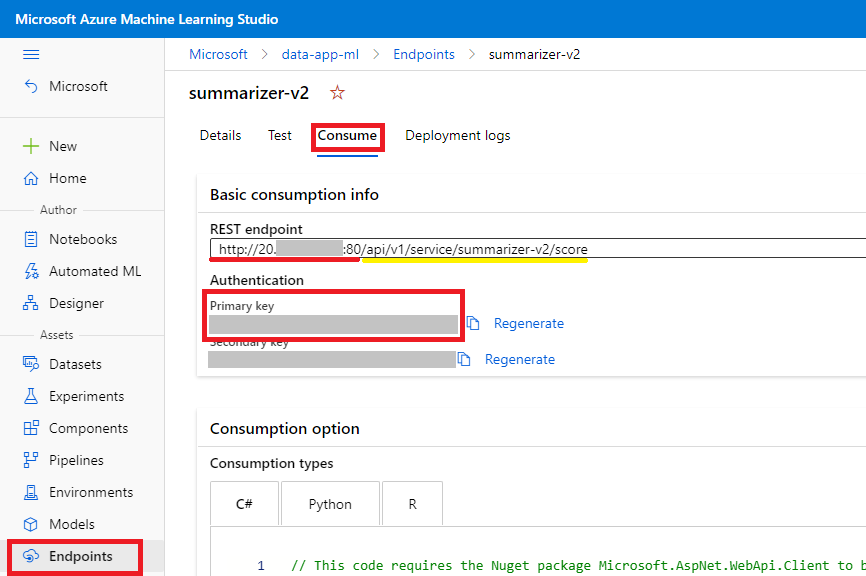

<div class="MCWHeader1">
Cloud Native Text Analytics Platform
</div>

<div class="MCWHeader2">
Deployment Step-by-Step
</div>

<div class="MCWHeader3">
July 2022
</div>

Information in this document, including URL and other Internet Web site references, is subject to change without notice. Unless otherwise noted, the example companies, organizations, products, domain names, e-mail addresses, logos, people, places, and events depicted herein are fictitious, and no association with any real company, organization, product, domain name, e-mail address, logo, person, place or event is intended or should be inferred. Complying with all applicable copyright laws is the responsibility of the user. Without limiting the rights under copyright, no part of this document may be reproduced, stored in or introduced into a retrieval system, or transmitted in any form or by any means (electronic, mechanical, photocopying, recording, or otherwise), or for any purpose, without the express written permission of Microsoft Corporation.

Microsoft may have patents, patent applications, trademarks, copyrights, or other intellectual property rights covering subject matter in this document. Except as expressly provided in any written license agreement from Microsoft, the furnishing of this document does not give you any license to these patents, trademarks, copyrights, or other intellectual property.

The names of manufacturers, products, or URLs are provided for informational purposes only, and Microsoft makes no representations and warranties, either expressed, implied, or statutory, regarding these manufacturers or the use of the products with any Microsoft technologies. The inclusion of a manufacturer or product does not imply endorsement of Microsoft of the manufacturer or product. Links may be provided to third-party sites. Such sites are not under the control of Microsoft and Microsoft is not responsible for the contents of any linked site or any link contained in a linked site, or any changes or updates to such sites. Microsoft is not responsible for webcasting or any other form of transmission received from any linked site. Microsoft is providing these links to you only as a convenience, and the inclusion of any link does not imply endorsement of Microsoft of the site or the products contained therein.

© 2022 Microsoft Corporation. All rights reserved.

Microsoft and the trademarks listed at <https://www.microsoft.com/en-us/legal/intellectualproperty/Trademarks/Usage/General.aspx> are trademarks of the Microsoft group of companies. All other trademarks are the property of their respective owners.

**Contents**

- [Building a Cloud Native Text Analytics Platform Step-by-Step](#analyzing-text-with-azure-machine-learning-and-cognitive-services-step-by-step)
  - [Abstract and learning objectives](#abstract-and-learning-objectives)
  - [Overview](#overview)
  - [Solution architecture](#solution-architecture)
  - [Requirements](#requirements)
  - [Exercise 1: Create and deploy a Summarization Service](#exercise-1-create-and-deploy-a-summarization-service)
    - [Task 1: Locate and open the summarization notebook](#task-1-locate-and-open-the-summarization-notebook)
    - [Task 2: Run notebook - 01 Summarize](#task-2-run-notebook---01-summarize)
    - [Task 3: Run notebook - 02 Deploy Summarizer Web Service](#task-3-run-notebook---02-deploy-summarizer-web-service)
  - [Exercise 2: Create and deploy a custom Deep Learning Model using Keras](#exercise-2-create-and-deploy-a-custom-deep-learning-model-using-keras)
    - [Task 1: Run notebook - 03 Claim Classification](#task-1-run-notebook---03-claim-classification)
    - [Task 2: Run notebook - 04 Deploy Classifier Web Service](#task-2-run-notebook---04-deploy-classifier-web-service)
  - [Exercise 3: Text classification with Azure Automated Machine Learning](#exercise-3-text-classification-with-azure-automated-machine-learning)
    - [Task 1: Create new automated ML experiment](#task-1-create-new-automated-ml-experiment)
    - [Task 2: Create a new automated ML run](#task-2-create-a-new-automated-ml-run)
    - [Task 3: Monitor automated ML run](#task-3-monitor-automated-ml-run)
    - [Task 4: Review best model performance](#task-4-review-best-model-performance)
  - [Exercise 4: Completing the solution](#exercise-4-completing-the-solution)
    - [Task 1: Retrieve the Text Analytics API endpoint and key](#task-1-retrieve-the-text-analytics-api-endpoint-and-key)
    - [Task 2: Run notebook - 05 Cognitive Services](#task-2-run-notebook---05-cognitive-services)
  - [Exercise 5: Deploy microservices in AKS](#exercise-x-deploy-microservices-in-aks)
    - [Task 0: Pre-requirements](#task-0-pre-requirements)
    - [Task 1: Init configuration file](#task-1-init-configuration-file)
    - [Task 2: Deploy microservices to AKS](#task-2-deploy-microservices-to-aks)
  - [Exercise 6: Deploying your Power App](#exercise-y-deploying-your-power-app)
    - [Task 1: Import Canvas App](#task-1-import-canvas-app)
    - [Task 2: Prepare and import Power BI Dashboard](#task-2-prepare-and-import-power-bi-dashboard)
    - [Task 3: Configure canvas app](#task-3-configure-canvas-app)
  - [After completion](#after-completion)
    - [Task 1: Clean up resources](#task-1-clean-up-resources)
  

# Analyzing text with Azure Machine Learning and Cognitive Services step-by-step

## Abstract and learning objectives

In this step-by-step, you will implement a solution that combines both pre-built artificial intelligence (AI) in the form of various Cognitive Services with custom AI in the form of services built and deployed with Azure Machine Learning service. You will work with unstructured text and learning how to develop analytics pipelines for various problems such as text summarization, text classification, sentiment analysis and key phrase extraction. You learn how to build and train a deep neural net for text classification. You will also learn to build Automated Machine Learning models in Azure Machine Learning studio for the purposes of text classification. Finally, you will learn how to deploy multiple kinds of predictive services using Azure Machine Learning and learn to integrate with the Text Analytics API from Cognitive Services. 

At the end of this implementation, you will be better able to present solutions leveraging Azure Machine Learning services and Cognitive Services.

Additionally, you will have the chance to deploy a set of microservices to a k8s cluster. These microservices will interact with a CosmosDB instance, where data will be stored and also to above mentioned services, such as Text Analytics APIs and trained models.

Finally, you will deploy a PowerApp that will consume these microservices APIs to create a full end-to-end scenario.

## Overview

In this deployment, you will help Contoso Ltd. build a proof of concept that shows how they can develop a solution that amplifies their agents' claims processing capabilities.

## Solution architecture

The high-level architecture of the solution is illustrated in the diagram. The case is performed within the context of a notebook running within Azure Machine Learning compute instance. Various notebooks are built to test the integration with the Cognitive Services listed, train custom ML services, and integrate the results in a simple user interface that shows the effect of processing the claim with all the AI services involved.

Also, there will be two microservices present in the architecture that will offer a set of APIs to possible consumers. One consumer of these microservices in this architecture is the Power App, that will provide the user with a simple but complete UI to get a great user experience during the demonstration of every capability of the whole architecture.


## Requirements

1. You will need an Azure subscription with permissions to deploy resource groups and resources into them.

    - Trial subscriptions will not work. You will run into issues with Azure resource quota limits.
    - Subscriptions with access limited to a single resource group will not work. You will need the ability to deploy multiple resource groups.

2. You will need a Microsoft 365 with the folling licensing and permissions. You can contact your tenant administrators if any of the following are missing, or as an alternative, provision a 30-day demo tenant [here.](https://signup.microsoft.com/get-started/signup?products=101bde18-5ffb-4d79-a47b-f5b2c62525b3&culture=en-US&country=US&ali=1&bac=1&signedinuser=jocaffar%40microsoft.com)

    - Enterprise licensing (E3/E5) or Business Premium
    - Power Automate/Power App per user plan (premium HTTP connector required)
    - Power App publishing permissions

3. Power BI Desktop.

## Exercise 1: Create and deploy a Summarization Service

Duration: 60 minutes

In this exercise, you create and deploy a web service that uses a pre-trained model to summarize long text paragraphs.

### Task 1: Locate and open the summarization notebook

In this task, you will navigate to the folder where all the notebooks for this lab are available. Then you will open the `Summarization` notebook and confirm that the compute instance is attached to the notebook.

1. From within Azure Machine Learning studio, navigate to the `Notebooks` section by selecting it from the left-hand navigation menu. Then select the notebook: **cloud-native-text-analytics-platform/notebooks/01 Summarize.ipynb**. From the toolbar select **Compute** and confirm that the compute instance created in `Setup Guide` is selected and is in running state.

    

### Task 2: Run notebook - 01 Summarize

1. Read the instructions at the top of the notebook and execute the notebook cells one by one by selecting the **Run cell** arrow.

    

### Task 3: Run notebook - 02 Deploy Summarizer Web Service

1. Within the `notebooks` folder, select the notebook called **02 Deploy Summarizer Web Service.ipynb**. This opens the notebook so you can read and execute the code it contains.

2. Read the instructions at the top of the notebook, and execute the cells as instructed.

3. Make sure you copy the scoring URI from the output of the last cell of this notebook. The scoring URI value is needed in the final notebook of this hands-on lab.

## Exercise 2: Create and deploy a custom Deep Learning Model using Keras

Duration: 60 minutes

In this exercise, you use Keras to construct and train a Deep Neural Network (DNN) called the Long Short-Term Memory (LSTM) recurrent neural network. LSTM works well for text classification problems, especially when used in conjunction with word embedding such as GloVe for word vectorization. In this notebook, you also learn how GloVe word embeddings perform on word analogy tasks.

### Task 1: Run notebook - 03 Claim Classification

1. Within the `notebooks` folder, select the notebook named **03 Claim Classification.ipynb**. This opens the notebook so you can read and execute the code it contains.

2. Read the instructions at the top of the notebook, and execute the cells as instructed.

   > **Note**: Pay attention to the top of the notebook and check the TensorFlow library version. The TensorFlow version should be 2.2.0.

### Task 2: Run notebook - 04 Deploy Classifier Web Service

1. Within the `notebooks` folder, select the notebook named **04 Deploy Classifier Web Service.ipynb**. This opens the notebook so you can read and execute the code it contains.

2. Read the instructions at the top of the notebook, and execute the cells as instructed.

3. Make sure you copy the scoring URI from the output of the last cell of this notebook. The scoring URI value is needed in the final notebook of this hands-on lab.

## (Optional) Exercise 3: Text classification with Azure Automated Machine Learning

Duration: 75 minutes

This exercise is not required for the solution but it provides an alternative for model deployment that focuses on no-code approach using AutoML

Automated machine learning picks an algorithm and hyperparameters for you and generates a model ready for deployment. You can create and run automated machine learning experiments in code using the [Azure ML Python SDK](https://docs.microsoft.com/en-us/azure/machine-learning/service/how-to-configure-auto-train) or if you prefer a no code experience, you can also Create your automated machine learning experiments in the [Azure portal](https://docs.microsoft.com/en-us/azure/machine-learning/service/how-to-create-portal-experiments).

In this exercise, you learn how to create, run, and explore automated machine learning experiments in the Azure portal without a single line of code. We will train a classification model for claim text that will predict `1` if the claim is an auto insurance claim or `0` if it is a home insurance claim.

> **Note**: You need to complete running the notebook **03 Claim Classification.ipynb** from `Exercise 2 Task 1` before starting this exercise.

### Task 1: Create new automated ML experiment

1. From within Azure Machine Learning studio, select **Home, Create new, Automated ML run**.

   

1. This will open a `Create a new Automated ML run` page.

### Task 2: Create a new automated ML run

1. Select the dataset **claims-dataset** created during `Exercise 2` and then select **Next**.

  

2. In the `Configure run` page, make the following selections, and then select **Next**:

   - Existing experiment: **claims-classification-exp**
   - Target column: **labels (Integer)**
   - Select Azure ML compute cluster: **amlcompute-ad**

  

3. In the `Select task type` page make the following selections, and then open the `Additional configurations` dialog by selecting **View additional configuration settings**:

   - Task type: **Classification**
   - Enable deep learning: **Checked**

4. In the `Additional configurations` dialog make the following selections and then select **Save**:

   - Training job timeout (hours): **1**

5. In the `Select task type` page select **Next**.

  

6. In the `Select the validation and test type` page make the following selections and then select **Finish** to start the AutoML experiment run.

   - Validation type: **Train-validation split**
   - Percentage validation of data: **10**

  

### Task 3: Monitor automated ML run

1. You can monitor the experiment from the run details page. Initially run status is `Not started`. Wait till the run status is `Completed`.

  

> **Note**: The Automated ML run will for around 40-60 minutes. It is recommended you complete Exercise 4 and then return to complete Exercise 3.

### Task 4: Review best model performance

1. Select the **Models** tab to review the model pipelines that were trained during the experiment run.

  

2. Select the **algorithm** with the best score on the primary metric `AUC weighted`.

  

3. Select the **Metrics** tab to review the various performance metrics and charts.

  

  > **Note**: You have the option to deploy the trained model pipeline to either Azure Container Instance or Azure Kubernetes Service directly from the Azure ML Studio.

## Exercise 4: Completing the solution

Duration: 45 minutes

In this exercise, you perform the integration with the Text Analytics APIs and the Azure Machine Learning service you previously deployed to deliver the proof of concept solution.

### Task 1: Retrieve the Text Analytics API endpoint and key

In this task, you will retrieve the API key and endpoint URI associated with your Text Analytics API.

1. In the [Azure portal](https://portal.azure.com), select **Resource groups** from the Azure services list.

   

2. Select the `hands-on-lab-SUFFIX` resource group you created for this hands-on lab from the list of resource groups.

    

3. Select your Text Analytics Cognitive Services resource from the list.

    

4. Select **Keys and Endpoint** from the left-hand navigation menu and then copy the **Key 1** and **Endpoint** values into a text editor, such as Notepad.exe, or something similar as you will need this value later in this exercise.

    

### Task 2: Run notebook - 05 Cognitive Services 

1. From within Azure Machine Learning Studio, navigate to the `Notebooks` section by selecting it from the left-hand navigation menu. Then select the notebook: **cloud-native-text-analytics-platform/notebooks/05 Cognitive Services.ipynb**. This opens the notebook so you can read and execute the code it contains.

2. Follow the steps within the notebook to complete the lab and view the result of combining Cognitive Services with your Azure Machine Learning Services.


## Exercise 5: Deploy microservices in AKS

Duration: 30 minutes

In this exercise, you wll deploy both **claims-manager** and **claims-reader** microservices to the existing Kubernetes cluster. We will use the **Azure cloud shell**, which has all the prerequired tooling installed.

### Task 0: Pre-requirements

1. In the [Azure portal](https://portal.azure.com), open a new **Azure Cloud Shell**. Do not forget to use **bash**:


2. Clone resources repository in the home directory:

```
<youruser>@Azure:~$ git clone https://github.com/dsanchor/MCW-Analyzing-text-with-Azure-Machine-Learning-and-Cognitive-Services.git sources
```

3. Once cloned, move to the directory where we have the source code for the  microservices:

```
<youruser>@Azure:~$ cd sources/Hands-on\ lab/microservices/
```

### Task 1: Init configuration file

Before deploying both microservices, we will require some configuration in order to connect to:

- CosmosDb instance
- Summarizer service
- Classifier service
- Text analytics: Sentiment Analysis and Key Phrase Extraction

The following diagram summarizes all the interactions between the microservices and the above mentioned services:


1. Let's start by  validating that an empty **config.properties** file exists and has been properly cloned:

```
<youruser>@Azure:~/sources/Hands-on lab/microservices$ cat config.properties 

AZURE_COSMOS_KEY= 
AZURE_COSMOS_URI=
AZURE_COSMOS_DATABASE= 
MANAGER_CLASSIFIER_URL= 
MANAGER_CLASSIFIER_PATH= 
MANAGER_CLASSIFIER_KEY= 
MANAGER_SUMMARIZER_URL=
MANAGER_SUMMARIZER_PATH=
MANAGER_SUMMARIZER_KEY=
MANAGER_TEXTANALYTICS_KEY=
MANAGER_TEXTANALYTICS_ENDPOINT=
AKS_DOMAIN=
````

2. To simplify edition of this file, let's open an editor within the **Azure Cloud Shell** by clicking in the **{}** icon. Then, navigate to the **config.properties** file and open it.


3. Get the **CosmosDB** attributes. To do, select your **CosmosDb** instance and under **Settings**, click on **Keys**. Copy both **URI** and **PRIMARY KEY**. For the database name, click in **Data Explorer** and get the name of your database right below the **DATA** label. It is very likely that the database name is **ClaimsDb**.

4. For the **Classifier** and **Summarizer** attributes, select your **Machine Learning** instance and open the **Azure Machine Learning Studio**.  For each **Endpoint** (classifier and summarizer), move to the **Consume** tab and get the URL, PATH and KEY. Notice that you will get the **REST endpoint**, see next picture for more details, where the **URL** is underlined in red and **PATH** in yellow. 



5. Now, you must get the **KEY** and **ENDPOINT** for the **Text Analytics** service. Open your **Cognitive Service for Language** and on the **Resource Management** pane, click on **Keys and Endpoints**. Copy both the **KEY 1** and **Endpoint** values and set them in the **config.properties** file accordingly.

6. And finally, get the **AKS dns zone** that will be used to expose all of our apps. Ensure you use the correct **Resource group** name and **AKS** cluster. In this example command, we use the ones mentioned in the **Setup Guide**:

```
az aks show -n mlaks -g hands-on-lab --query addonProfiles.httpApplicationRouting.config.HTTPApplicationRoutingZoneName -o table
```

Take note of the output and place it in the **AKS_DOMAIN** property. 

**Example of a config.properties** with all values:

```
AZURE_COSMOS_KEY=xxxxxxxxxxxxxxxxxxxxxxxxxxxxxxxxxxxxxxxx
AZURE_COSMOS_URI="https://claims.documents.azure.com:443/"  
AZURE_COSMOS_DATABASE="ClaimsDb" 
MANAGER_CLASSIFIER_URL="http://1.2.3.4:80" 
MANAGER_CLASSIFIER_PATH="/api/v1/service/claimclassservice-v2/score" 
MANAGER_CLASSIFIER_KEY="yyyyyyyyyyyyy" 
MANAGER_SUMMARIZER_URL="http://1.2.3.4:80" 
MANAGER_SUMMARIZER_PATH="/api/v1/service/summarizer-v2/score" 
MANAGER_SUMMARIZER_KEY="zzzzzzzzzzzzz" 
MANAGER_TEXTANALYTICS_KEY=wwwwwwwwwwwwwwwwwwwwwwww 
MANAGER_TEXTANALYTICS_ENDPOINT="https://data-app-text.cognitiveservices.azure.com/"
AKS_DOMAIN=18f89dfed879865pdf.westeurope.aksapp.io 
```

7. Just to avoid some problems during the process of variable substitution using **sed** in next steps, let`s escape the '/' char:

```
<youruser>@Azure:~/sources/Hands-on lab/microservices$ sed 's/\//\\\//g' config.properties 
```

8. And finally, set every property in the file as Enviroment variable:

```
<youruser>@Azure:~/sources/Hands-on lab/microservices$ source config.properties 
```

### Task 2: Deploy microservices to AKS

1. Get AKS credentials. Ensure you use the correct **Resource group** name and **AKS** cluster. In this example command, we use the ones mentioned in the **Setup Guide**::

```
<youruser>@Azure:~/sources/Hands-on lab/microservices$ az aks get-credentials -n mlaks -g hands-on-lab

The behavior of this command has been altered by the following extension: aks-preview
Merged "mlaks" as current context in /home/<youruser>/.kube/config
```

2. Create a **namespace**:

```
<youruser>@Azure:~/sources/Hands-on lab/microservices$ kubectl create namespace appinnovation

namespace/appinnovation created

```

3. Deploy **claims-manager** and **claims-reader** microservices. The base template containing the k8s descriptors for each microservice is under **src/main/k8s** folder. Feel free to have a look at the content of the **app.yaml** to understand what will be created in **AKS**. 

Let's start with the **claims-manager** microservice. We will use all the 'Environment Variables' we previously initialized as a replacement in the original **app.yaml** k8s descriptors:

Execute:
```
sed -e "s/\${AKS_DOMAIN}/$AKS_DOMAIN/g" \
    -e "s/\${AZURE_COSMOS_KEY}/$AZURE_COSMOS_KEY/g" \
    -e "s/\${AZURE_COSMOS_URI}/$AZURE_COSMOS_URI/g" \
    -e "s/\${AZURE_COSMOS_DATABASE}/$AZURE_COSMOS_DATABASE/g" \
    -e "s/\${MANAGER_CLASSIFIER_URL}/$MANAGER_CLASSIFIER_URL/g" \
    -e "s/\${MANAGER_CLASSIFIER_PATH}/$MANAGER_CLASSIFIER_PATH/g" \
    -e "s/\${MANAGER_CLASSIFIER_KEY}/$MANAGER_CLASSIFIER_KEY/g" \
    -e "s/\${MANAGER_SUMMARIZER_URL}/$MANAGER_SUMMARIZER_URL/g" \
    -e "s/\${MANAGER_SUMMARIZER_PATH}/$MANAGER_SUMMARIZER_PATH/g" \
    -e "s/\${MANAGER_SUMMARIZER_KEY}/$MANAGER_SUMMARIZER_KEY/g" \
    -e "s/\${MANAGER_TEXTANALYTICS_KEY}/$MANAGER_TEXTANALYTICS_KEY/g" \
    -e "s/\${MANAGER_TEXTANALYTICS_ENDPOINT}/$MANAGER_TEXTANALYTICS_ENDPOINT/g" \
    claims-manager/src/main/k8s/app.yaml | kubectl apply -f - -n appinnovation
```

And then, perform the same action for the **claims-reader** microservice:

```
sed -e "s/\${AKS_DOMAIN}/$AKS_DOMAIN/g" \
    -e "s/\${AZURE_COSMOS_KEY}/$AZURE_COSMOS_KEY/g" \
    -e "s/\${AZURE_COSMOS_URI}/$AZURE_COSMOS_URI/g" \
    -e "s/\${AZURE_COSMOS_DATABASE}/$AZURE_COSMOS_DATABASE/g" \
    claims-reader/src/main/k8s/app.yaml | kubectl apply -f - -n appinnovation
```

4. You can check under which hosts these two microservices are exposed by running the following command:

```
<youruser>@Azure:~/sources/Hands-on lab/microservices$ kubectl get ingress -n appinnovation
```

Feel free to perform a simple test by querying all the existing 'claims' using the **claims-reader** service (note that there is not any claim in the system yet.. you should get an empty array):

```
<youruser>@Azure:~/sources/Hands-on lab/microservices$ curl -v  claims-reader.${AKS_DOMAIN}/claims
```

## Exercise 6: Deploying your Power App

Duration: 40 minutes

In this exercise, you wll import the Claim_App.zip canvas app into your environment. We will navigate through the Power Apps [site](https://make.powerapps.com/), Power Apps studio and PowerBI [site](https://app.powerbi.com/) to complete this section. 


### Task 1: Import canvas app

Navigate to https://make.powerapps.com/

1. Check you are in the desired Environment
2. Menu > Apps > Import Canvas App
3. Upload zip package: Claim_App
4. Import Setup: Create as new for the PowerApp and proposed flows
5. Select Import

Now, we must acrivate the imported flows from our canvas app.

6. Menu > Flows
7. Claim_App_GETALLCLAIMS (open options) and Turn ON
8. Claim_App_POSTCLAIM (open options) and Turn ON
      
      
### Task 2: Prepare and import Power BI Dashboard
      
1. Download the powerBI_claimApp.pbix from the git content folder and open in Power BI Desktop
2. Home > Transform Data > Open the Data Source Settings
3. Select Data sources in current files
4. Select Cosmos DB
5. Edit Permissions > Edit Credentials
6. Introduce Cosmos DB Account key and save
7. Save report to current file

8. Navigate to https://app.powerbi.com/
9. Menu > Create
10. New workspace
11. Provide workspace name, for example: Claim App Workspace
12. Save
13. Menu > Claim App Workspace
14. New > Upload a file
15. Import powerBI_claimApp.pbix to workspace


### Task 3: Configure canvas app

Navigate to https://make.powerapps.com/
  
1. Menu > FLows 
2. Edit Claim_App_GETALLCLAIMS
3. Open the HTTP connector step in the flow
4. Modify the connector Uri to your AKS public endpoint
5. Save flow and exit
6. Repeat for Claim_App_POSTCLAIM
  
7. Menu > Apps > Claim_App > Edit
8. Screens > Claim Dashboard
9. Select the Power BI object and open the connection pane
10. Select your newly created workspace and connect to the Claim Dashboard report and tile
11. File > Save and Publish

## After the implementation

Duration: 5 minutes

To avoid unexpected charges, it is recommended that you clean up all your lab resources when you complete the lab.

### Task 1: Clean up lab resources

1. In the [Azure portal](https://portal.azure.com), select **Resource groups** from the Azure services list.

   

2. Select the `rg-text-analytics-SUFFIX` resource group you created for this hands-on lab from the list of resource groups.

    

3. Select **Delete resource group** from the command bar.

    

4. In the confirmation dialog that appears, enter the name of the resource group, and select **Delete**.

5. Wait for confirmation the Resource Group has been successfully deleted. If you don't wait, and the delete fails for some reason, you may be left with resources running that were not expected. You can monitor using the Notifications dialog, which is accessible from the Alarm icon.

    

6. When the Notification indicates success, the cleanup is complete.

TODO put it in the right place and review TBD tags