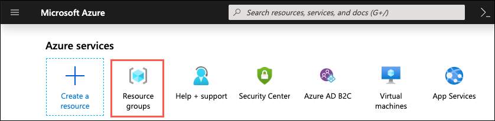
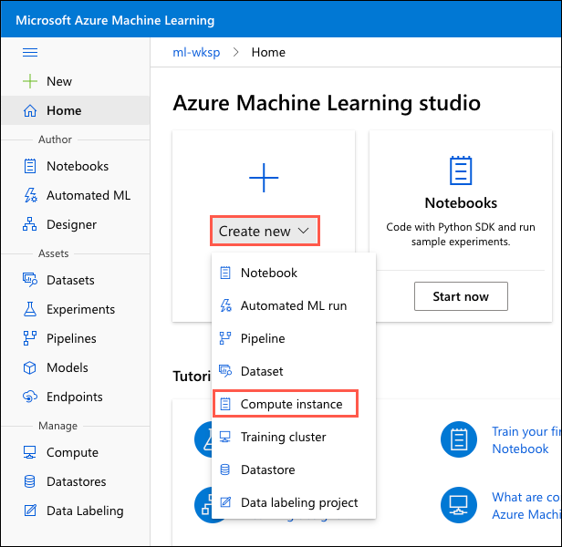

# Cloud Native Text Analytics Platform 

## Setup guide

July 2022

Information in this document, including URL and other Internet Web site references, is subject to change without notice. Unless otherwise noted, the example companies, organizations, products, domain names, e-mail addresses, logos, people, places, and events depicted herein are fictitious, and no association with any real company, organization, product, domain name, e-mail address, logo, person, place or event is intended or should be inferred. Complying with all applicable copyright laws is the responsibility of the user. Without limiting the rights under copyright, no part of this document may be reproduced, stored in or introduced into a retrieval system, or transmitted in any form or by any means (electronic, mechanical, photocopying, recording, or otherwise), or for any purpose, without the express written permission of Microsoft Corporation.

Microsoft may have patents, patent applications, trademarks, copyrights, or other intellectual property rights covering subject matter in this document. Except as expressly provided in any written license agreement from Microsoft, the furnishing of this document does not give you any license to these patents, trademarks, copyrights, or other intellectual property.

The names of manufacturers, products, or URLs are provided for informational purposes only and Microsoft makes no representations and warranties, either expressed, implied, or statutory, regarding these manufacturers or the use of the products with any Microsoft technologies. The inclusion of a manufacturer or product does not imply endorsement of Microsoft of the manufacturer or product. Links may be provided to third party sites. Such sites are not under the control of Microsoft and Microsoft is not responsible for the contents of any linked site or any link contained in a linked site, or any changes or updates to such sites. Microsoft is not responsible for webcasting or any other form of transmission received from any linked site. Microsoft is providing these links to you only as a convenience, and the inclusion of any link does not imply endorsement of Microsoft of the site or the products contained therein.

© 2022 Microsoft Corporation. All rights reserved.

Microsoft and the trademarks listed at <https://www.microsoft.com/en-us/legal/intellectualproperty/Trademarks/Usage/General.aspx> are trademarks of the Microsoft group of companies. All other trademarks are property of their respective owners.

**Contents**

<!-- TOC -->

- [Cloud Native Text Analytics Platform](#cloud-native-text-analytics-platform)
  - [Setup guide](#setup-guide)
  - [Requirements](#requirements)
  - [Setup guide](#setup-guide-1)
    - [Task 1: Create a resource group](#task-1-create-a-resource-group)
    - [Task 2: Provision a Text Analytics API](#task-2-provision-a-text-analytics-api)
    - [Task 3: Provision an Azure Container Registry](#task-3-provision-an-azure-container-registry)
    - [Task 4: Create an Azure Machine Learning workspace](#task-4-create-an-azure-machine-learning-workspace)
    - [Task 5: Create an Azure Kubernetes Service](#task-5-create-an-azure-kubernetes-service)
    - [Task 6: Create compute instance and configure AKS compute in Azure Machine Learning Studio](#task-6-create-compute-instance-and-configure-aks-compute-in-azure-machine-learning-studio)
    - [Task 7: Deploy a CosmosDB instance](#task-7-deploy-a-cosmosdb-instance)
    - [Task 8: Import the lab notebooks](#task-8-import-the-lab-notebooks)
    - [Task 9: Setup lab environment](#task-9-setup-lab-environment)

<!-- /TOC -->

## Requirements

1. You will need an Azure subscription with permissions to deploy resource groups and resources into them. 

2. You must be a subscription contributor with the user access administrator role or a subscription owner.

## Setup guide

Duration: 45 minutes 

In this exercise, you set up your environment for use in the rest of the deployment. You should follow all steps provided in the setup guide.

> **Important**: Many Azure resources require globally unique names. Throughout these steps, the word "SUFFIX" appears as part of resource names. You should replace this with your Microsoft alias, initials, or other value to ensure uniquely named resources. 

### Task 1: Create a resource group

1. In the [Azure portal](https://portal.azure.com), select **Resource groups** from the Azure services list.

   

2. On the Resource groups blade, select **Create**.
   

3. On the Create a resource group **Basics** tab, enter the following:

   - **Subscription**: Select the subscription you are using.
   - **Resource group**: Enter `hands-on-lab` as the name of the new resource group.
   - **Region**: Select the region where you want to deploy your resources.

   

4. Select **Review + Create**.

5. On the **Review + create** tab, ensure the Validation passed message is displayed and then select **Create**.

### Task 2: Provision a Text Analytics API

In this task, you create a Text Analytics API, which will be integrated into your final POC.

1. In the [Azure portal](https://portal.azure.com/), select the **Show portal menu** icon and then choose **+Create a resource** from the menu.

   

2. Select **AI + Machine Learning** in the Azure Marketplace list and then select **Language service, Create** from the featured services list.

    

3. On the `Select additional features` tab, select **Continue to create your resource**.

4. On the `Create` tab, provide the following:

    Project details:

    - **Subscription**: Select the subscription you are using.
    - **Resource group**: Select the `hands-on-lab` resource group from the dropdown list.
  

    
    Instance Details:

    - **Region**: Select the region you used for the hands-on-lab resource group.
    - **Name:** Provide a unique name for this instance, such as ta-SUFFIX.
    - **Pricing tier**: Free F0 (5K Transactions per 30 days).
    - **Responsible AI Notice**: Checked

    

5. Select **Review + create**.

6. Ensure validation passes and then select **Create** on the `Review + create` tab.

### Task 3: Provision an Azure Container Registry 

In this task, you provision the Azure Container Registry where docker images will be pushed and pulled from different components of these lab. 

1. In the [Azure portal](https://portal.azure.com/), select the **Show portal menu** icon and then choose **+Create a resource** from the menu.

2. Use the search bar to find the **Container Registry**.

3. Select **Container Registry**.

4. In the **Container Registry** pane, select **Create** to begin.

5. Provide the following information to configure your new workspace:

    - **Subscription**: Select the subscription you are using.
    - **Resource group**: Select the hands-on-lab resource group from the dropdown list.

   - **Registry name**: Provide a unique name that identifies your registry, such as `acrSUFFIX`. This name must be globally unique.

   - **Location**: Select the location you used for the hands-on-lab resource group.

   - **SKU**: Leave the default one (Standard).

   

5. Select **Review + create**.

6. Ensure validation passes and then select **Create** on the `Review + create` tab.

7. To view the new Container Registry, select **Go to resource**.

8. Navigate to **Settings**, click on `Access Keys` and enable **Admin user**. By doing so, we let AML access to this registry once linked as will see in next step.

   

### Task 4: Create an Azure Machine Learning workspace

In this task, you provision the Azure Machine Learning workspace.

1. In the [Azure portal](https://portal.azure.com/), select the **Show portal menu** icon and then choose **+Create a resource** from the menu.

2. Use the search bar to find the **Machine Learning**.

3. Select **Machine Learning**.

4. In the **Machine Learning** pane, select **Create** to begin.

   

5. Provide the following information to configure your new workspace:

   - **Subscription**: Select the subscription you are using.

   - **Resource group**: USelect the hands-on-lab resource group from the dropdown list.

   - **Workspace name**: Provide a unique name that identifies your workspace, such as ml-wksp-SUFFIX. 
  
   - **Location**: Select the location you used for the hands-on-lab resource group.

   - **Container registry**: Select an existing container registry in your subscription (We created on in previous step).

   

6. Select **Review + create**.

7. Ensure validation passes and then select **Create** on the `Review + create` tab.

    > **Note**: It can take several minutes to create your workspace in the cloud.

    When the process is finished, a deployment success message appears.

8. To view the new workspace, select **Go to resource**.

9. Navigate to the [Azure Machine Learning Studio](https://ml.azure.com) and select the workspace that you created or select **Launch now** under **Try the new Azure Machine Learning studio** in the **Overview** section of your Azure Machine Learning workspace.

   

### Task 5: Create an Azure Kubernetes Service

In this task, you will create an Azure Kubernetes Service that it will be used as a compute resource to your Azure Machine Learning workspace and also, the Kubernetes cluster for a set of microservices.

1. In the [Azure portal](https://portal.azure.com/), select the **Show portal menu** icon and then choose **+Create a resource** from the menu.

2. Use the search bar to find the **Kubernetes Service**.

3. Select **Kubernetes Service**.

4. In the **Kubernetes Service** pane, select **Create** to begin.

   

5. Provide the following information to configure your new AKS. Leave defaults if not specified below:
   
   - **Subscription**: Select the subscription you are using.

   - **Resource group**: Select the hands-on-lab resource group from the dropdown list.

   - **Cluster preset configuration**: Leave default (**Standard ($$)**).
  
   - **Kubernetes cluster name**: Provide a unique name that identifies your workspace, such as aksSUFFIX.

   - **Region**: Select the region you used for the hands-on-lab resource group.

   - **Node count range**: Set a minimum of 3 nodes.

   

6. Move to **Networking** tab and mark **Enable HTTP application routing**. 

   NOTE: This will create a simple Kubernetes Ingress controller for testing purposes. Do not use this option in a production enviroment. [Learn more.](https://docs.microsoft.com/en-us/azure/aks/http-application-routing)

7. Next, in the **Integrations** tab: 

   - **Container registry**: Select the Azure Container Registry we previously created.
   - **Container Monitoring**: You can keep it enabled, as recommendation for any production cluster. If for this lab you want to disable it to avoid some extra costs, martk the **Disabled** radio button.

   

8. Select **Review + create**.

9. Ensure validation passes and then select **Create** on the `Review + create` tab.

### Task 6: Create compute instance and configure AKS compute in Azure Machine Learning Studio

1. Navigate to the [Azure Machine Learning Studio](https://ml.azure.com) and select the workspace that you created or select **Launch now** under **Try the new Azure Machine Learning studio** in the **Overview** section of your Azure Machine Learning workspace.

   

2. Select **Create new** and then select **Compute instance** from the context menu.

   

3. On the create compute instance screen, enter the following information:

   - **Compute name**: Enter computeSUFFIX.
   - **Virtual machine size**: Standard_DS3_v2 (or any other standard option)

   

4. Select **Create** and wait for the Compute Instance to be ready. It takes approximately 3-5 minutes for the compute provisioning to complete.

5. Within the Azure Machine Learning studio interface, under the **Manage** section on the left, select **Compute**, and go to **Inference Clusters**.

6. Click on **+ New** and click on **Use exisiting**. Select the AKS cluster previously created. 
7. **Next**. Provide a unique name that identifies your compute cluster, such as aksSUFFIX.
8. Select **Create**

### Task 7: Deploy a CosmosDB instance

In this task, you will create an CosmosDb instance with a single database, that will contain a Claims container to hold all the information of future claims.

1. In the [Azure portal](https://portal.azure.com/), select the **Show portal menu** icon and then choose **+Create a resource** from the menu.

2. Use the search bar to find the **Cosmos Db**.

3. Select **Azure Cosmos Db**.

4. In the **Azure Cosmos Db** pane, select **Create** to begin.

   

5. Then, within the **Select API option**, select **Core (SQL) - Recommended** and **Create**.

   

6. Provide the following information to configure your new Cosmos Db instance   :

   - **Subscription**: Select the subscription you are using.

   - **Resource group**: Select the hands-on-lab resource group from the dropdown list.

   - **Account name**: Set **claimscoresqlSUFFIX**.

   - **Location**: Select the location you used for the hands-on-lab resource group.

   - **Capacity mode**: To simplify configuration, set **Serverless** mode. To learn more about **Capacity modes**, have a look at the [official documentation](https://docs.microsoft.com/en-us/azure/cosmos-db/throughput-serverless).

   

8. Select **Review + Create**.

9. On the **Review + create** tab, ensure the Validation passed message is displayed and then select **Create**.

### Task 8: Import the lab notebooks

In this task, you import Jupyter notebooks from GitHub that you will use to complete the exercises in this hands-on lab.

1. Move to you Azure Machine Learning Studio and select the Compute Instance, **computeSUFFIX**, and then select **Jupyter** link to open Jupyter Notebooks interface.

   

2. Check **Yes, I understand** and select **Continue** in the trusted code dialog.

   

3. In the new Jupyter window, select **New** and then select **Terminal** from the context menu.

   
  
4. Run the following commands in order in the terminal window:

   - `mkdir ta-repo`
   - `cd ta-repo`
   - `git clone https://github.com/dsanchor/cloud-native-text-analytics-platform.git`

5. Wait for the `clone` command to finish importing the repo.

### Task 9: Setup lab environment

1. From the terminal window run the following commands (assuming you are in the `ta-repo` folder):

   - `cd "cloud-native-text-analytics-platform/notebooks"`
   - `conda activate azureml_py38`
   - `pip install --upgrade pip`
   - `pip install -r requirements.txt`

    > Note: You can safely ignore any dependency errors during installation.

